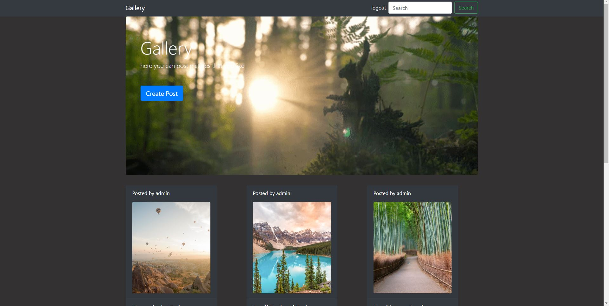

# Gallary_Django

## To start our project, we should start by typing
**If you are on Windows**

You need to write this 3 commands in terminal to activate and install dependencies 

>python -m venv env

>.\env\Scripts\activate 

>pip install -r requirements.txt

**2)**

> python manage.py migrate

**3)**

> python manage.py runserver
